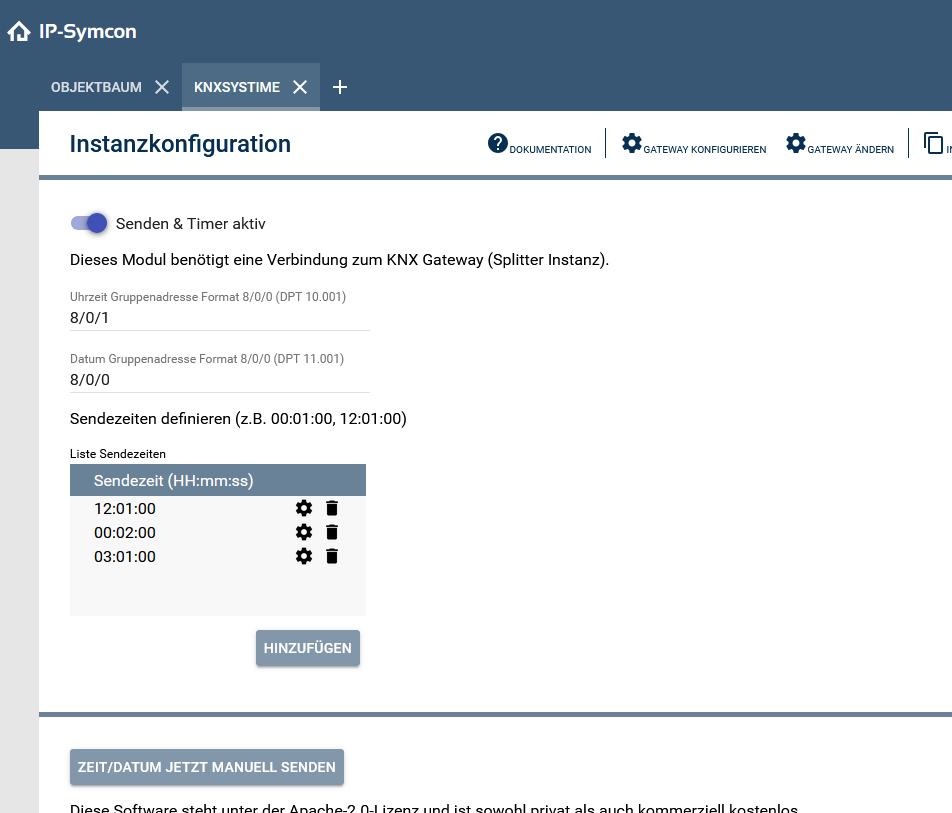

# KNXSystemZeitgeber

Modul zur automatischen Übertragung von Zeit- und Datumswerten an KNX-Gruppenadressen.  
Es unterstützt eine Liste von Sendezeiten, die zyklisch abgearbeitet werden, sowie das Aktivieren/Deaktivieren des Sendens über einen Schalter in der Konfiguration.

### Inhaltsverzeichnis

1. [Funktionsumfang](#1-funktionsumfang)
2. [Voraussetzungen](#2-voraussetzungen)
3. [Software-Installation](#3-software-installation)
4. [Einrichten der Instanzen in IP-Symcon](#4-einrichten-der-instanzen-in-ip-symcon)
5. [Statusvariablen und Profile](#5-statusvariablen-und-profile)
6. [Visualisierung und Konfiguration](#6-visualisierung-und-konfiguration)
7. [PHP-Befehlsreferenz](#7-php-befehlsreferenz)

### 1. Funktionsumfang

* Automatisches Senden der aktuellen Zeit (DPT 10.001) an eine KNX-Gruppenadresse.
* Automatisches Senden des aktuellen Datums (DPT 11.001) an eine KNX-Gruppenadresse.
* Verwaltung mehrerer Sendezeiten, die täglich abgearbeitet werden.
* Möglichkeit, das Senden und den Timer über einen Schalter (`Active`) zu aktivieren oder deaktivieren.
* Debug-Funktionalität zur Anzeige der gesendeten Daten im Symcon-Debug-Fenster.
* Kompatibel mit KNX-Gateway Interfaces über das KNX-Splitter-Modul.

### 2. Voraussetzungen

- IP-Symcon ab Version 8.1
- KNX-Gateway beziehungsweise kompatibles KNX-Splitter-Interface

### 3. Software-Installation

* Über den Module Store das `KNXSystemZeitgeber`-Modul installieren.
* Alternativ über das Module Control folgende URL hinzufügen:  
  https://github.com/BugForgeNerd/KNXSystemZeitgeber

### 4. Einrichten der Instanzen in IP-Symcon

Unter `Instanz hinzufügen` kann das `KNXSystemZeitgeber`-Modul mithilfe des Schnellfilters gefunden werden.  
Weitere Informationen zum Hinzufügen von Instanzen in der [Dokumentation der Instanzen](https://www.symcon.de/service/dokumentation/konzepte/instanzen/#Instanz_hinzufügen)

__Konfigurationsseite__:

| Name      | Beschreibung                                                     |
| --------- | ---------------------------------------------------------------- |
| Active    | Aktiviert/deaktiviert das Senden & Timer                         |
| GA_Time   | KNX-Gruppenadresse für die Zeit (DPT 10.001, Format z.B. 8/0/1)  |
| GA_Date   | KNX-Gruppenadresse für das Datum (DPT 11.001, Format z.B. 8/0/0) |
| SendTimes | Liste der Sendezeiten (HH:mm:ss)                                 |

### 5. Statusvariablen und Profile

Das Modul legt keine Statusvariablen, Kategorien oder Profile an.

#### Statusvariablen

| Name  | Typ | Beschreibung |
| ----- | --- | ------------ |
| Keine |     |              |

#### Profile

| Name  | Typ |
| ----- | --- |
| Keine |     |

### 6. Visualisierung und Konfiguration

* In der Instanzkonfiguration des Moduls können die Sendezeiten über die Instanzkonfiguration angepasst werden.
* Debug-Ausgaben werden im Symcon-Debug-Fenster angezeigt, einschließlich der HEX-Daten für Zeit und Datum.
* Empfehlung: Die Zeiten nicht zur vollen Stunde, insbesondere nicht um 00:00 Uhr, setzen zu lassen. Zur vollen Stunde, insbesondere zur Mitternachtszeit, laufen gerne andere automatische Funktionen, die das Setzen der Zeit auf den Bus kurzzeitig blockieren könnten. Um Mitternacht läuft beispielsweise von Symcon die Log-Rotation, die kurze Verzögerungen verursachen könnte. Zu empfehlen ist das Setzen der Zeit kurz nach 03:00 Uhr, da dann auch die Zeitumstellung erfasst wird. Darüber hinaus können ein oder zwei weitere Aktionen über den Tag verteilt hilfreich sein, wenn einmal der Strom weg war. Dann ist die Zeit wieder schnell gesetzt.

### 7. PHP-Befehlsreferenz

#### `KSZT_SendKNXTimeAndDate(int $InstanceID)`

Sendet die aktuelle Zeit und das Datum an die konfigurierten KNX-Gruppenadressen und setzt den nächsten Timer.

**Beispiel:**

Sendet das Datum und die Uhrzeit, die aktuell auf dem System liegen, auf den KNX-Bus. Die Zahl 12345 ist dabei durch die ID dieses Moduls zu ersetzen.

```php
KSZT_SendKNXTimeAndDate(12345);
```

## Screenshots:

<div>

</div>
