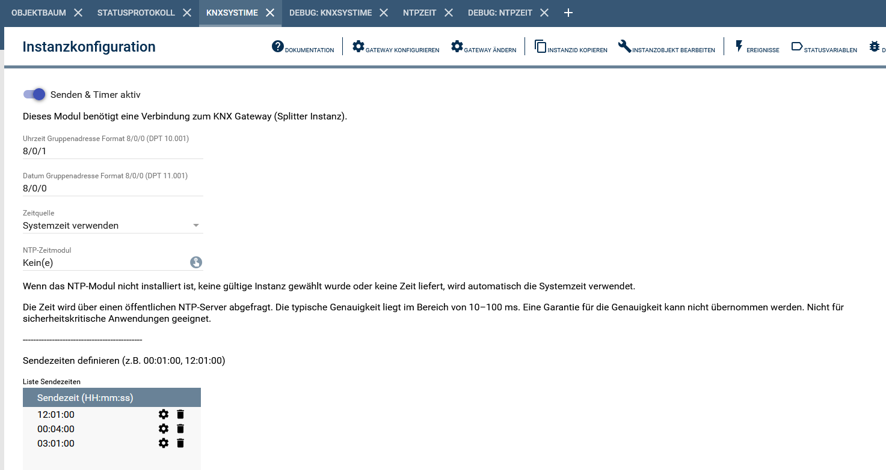
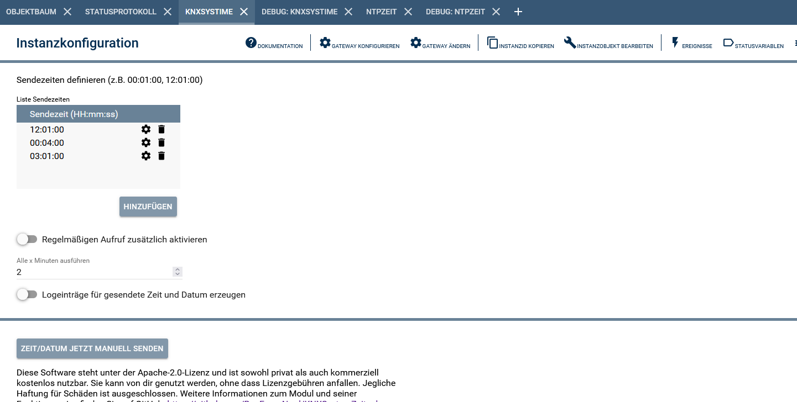
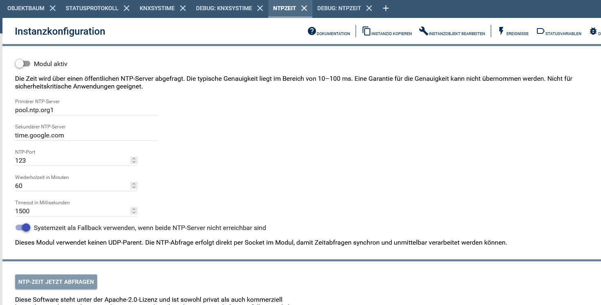

# KNXSystemZeitgeber / NTPZeit

Diese Modulsammlung besteht aus zwei eigenständigen, aber miteinander kombinierbaren Modulen:

- **KNXSystemZeitgeber** → sendet Zeit und Datum auf den KNX Bus
- **NTPZeit** → ermittelt eine präzise Zeit über NTP Server

Beide Module können **unabhängig voneinander** betrieben werden.  
Optional kann der KNXSystemZeitgeber die Zeit aus dem NTPZeit Modul beziehen.

---

# Inhaltsverzeichnis

1. Funktionsumfang
2. Modulübersicht
3. Voraussetzungen
4. Installation
5. Zusammenspiel der Module
6. Hintergrund: Direkte Socket-Abfrage
7. KNXSystemZeitgeber – Konfiguration
8. NTPZeit – Konfiguration
9. PHP Befehle
10. Screenshots

---

# 1. Funktionsumfang

## KNXSystemZeitgeber
- Senden von Zeit und Datum auf den KNX Bus
- Unterstützung für **DPT 10.001 + DPT 11.001** oder alternativ **DPT 19.001**
- Umschaltbares Sendeformat im Konfigurationsformular
- Liste fester Sendezeiten
- zusätzlicher Intervallbetrieb
- Auswahl der Zeitquelle (System / NTP)
- Logging optional abschaltbar
- Debugausgabe mit lesbarer Zeit + HEX

## NTPZeit
- Zeitabfrage von primärem NTP Server
- automatischer Fallback auf zweiten NTP Server
- optionaler Fallback auf Systemzeit
- Live-Zeitabfrage durch andere Module
- periodische Synchronisation möglich
- Debug + Genauigkeitshinweis

---

# 2. Modulübersicht

## KNXSystemZeitgeber
Dieses Modul sendet Zeit und Datum auf KNX Gruppenadressen.

Unterstützte KNX-Datenpunktformate:
- **DPT 10.001** → Uhrzeit
- **DPT 11.001** → Datum
- **DPT 19.001** → kombiniertes Datum/Uhrzeit

Die Zeitquelle kann sein:
- Systemzeit
- Zeit aus dem NTPZeit Modul

Das Modul arbeitet vollständig unabhängig und kann auch ohne NTPZeit betrieben werden.

## NTPZeit
Dieses Modul stellt eine präzisere Zeitquelle bereit.
Es kann:
- eigenständig genutzt werden
- von anderen Modulen abgefragt werden
- vom KNXSystemZeitgeber verwendet werden

Das Modul erzeugt Variablen:
- Datum
- Uhrzeit
- letzte Synchronisation
- Zeitquelle

---

# 3. Voraussetzungen

- IP-Symcon ab Version 8.1
- KNX Gateway (nur für KNXSystemZeitgeber)

Optional:
- Internetzugang für NTPZeit

---

# 4. Installation

Repository hinzufügen:

https://github.com/BugForgeNerd/KNXSystemZeitgeber

Danach stehen beide Module zur Verfügung:

- KNXSystemZeitgeber
- NTPZeit

---

# 5. Zusammenspiel der Module

Der KNXSystemZeitgeber kann optional das NTPZeit Modul verwenden.

Ablauf:

1. KNXSystemZeitgeber fragt NTPZeit ab
2. NTPZeit fragt NTP Server ab
3. Zeit wird synchron zurückgegeben
4. KNXSystemZeitgeber sendet Zeit auf KNX

Fallback Reihenfolge:

1. Primärer NTP Server
2. Sekundärer NTP Server
3. Systemzeit

Falls das NTP Modul:
- nicht vorhanden
- nicht erreichbar
- keine gültige Zeit liefert

wird automatisch die Systemzeit verwendet.

---

# 6. Hintergrund: Direkte Socket-Abfrage

Das Modul NTPZeit verwendet **keinen UDP Parent**.

Grund:
Der Symcon Parent Datenfluss arbeitet asynchron.

Bei asynchroner Kommunikation könnte:
- eine alte Zeit verwendet werden
- eine gepufferte Antwort eintreffen
- KNX falsche Zeit senden

Deshalb wird bewusst:
- ein direkter UDP Socket geöffnet
- synchron auf Antwort gewartet
- Zeit sofort zurückgegeben

Vorteile:

- deterministische Zeit
- keine Pufferung
- Live-Abfrage möglich
- präzise KNX Synchronisation

---

# 7. KNXSystemZeitgeber – Konfiguration

## Sendeformat

Der KNXSystemZeitgeber unterstützt zwei Betriebsarten:

### Modus 1: Getrennte Telegramme
In diesem Modus werden Zeit und Datum wie bisher getrennt gesendet:
- **GA_Time** → KNX DPT 10.001
- **GA_Date** → KNX DPT 11.001

Es werden zwei Telegramme auf den Bus gesendet:
- ein Telegramm für die Uhrzeit
- ein Telegramm für das Datum

### Modus 2: Kombiniertes Telegramm
In diesem Modus wird Datum und Uhrzeit gemeinsam gesendet:
- **GA_DateTime** → KNX DPT 19.001

Es wird ein gemeinsames 8-Byte-Telegramm auf den Bus gesendet.

## Besonderheiten bei DPT 19.001

Beim Versand über **DPT 19.001** werden folgende Informationen übertragen:
- Jahr
- Monat
- Tag
- Wochentag
- Stunde
- Minute
- Sekunde
- Sommerzeit-Information
- Working-Day-Information
- Qualitäts-/Statusbits

Verwendete Logik im Modul:
- **Wochentag** wird automatisch aus dem Datum berechnet
- **Sommerzeit** wird automatisch anhand der System-/NTP-Zeit gesetzt
- **Working Day**: alle Tage außer Sonntag gelten als Arbeitstag
- **Qualität** wird neutral gesendet
- **Fault** wird auf „kein Fehler“ gesetzt

## Konfigurationsoptionen

| Option | Beschreibung |
|--------|--------------|
| Active | Modul aktiv |
| SendFormat | Auswahl zwischen DPT 10.001 + 11.001 oder DPT 19.001 |
| GA_Time | Gruppenadresse Zeit für DPT 10.001 |
| GA_Date | Gruppenadresse Datum für DPT 11.001 |
| GA_DateTime | Gruppenadresse für kombiniertes Datum/Uhrzeit per DPT 19.001 |
| TimeSource | Systemzeit oder NTP |
| NTPTimeModuleID | NTP Modul Instanz |
| SendTimes | feste Sendezeiten |
| UseInterval | Intervall aktiv |
| IntervalMinutes | Intervall Minuten |
| EnableSendLog | Logmeldungen ein/aus |

Hinweis:
Je nach gewähltem **SendFormat** werden im Konfigurationsformular entweder die Felder **GA_Time** und **GA_Date** oder das Feld **GA_DateTime** verwendet.

---

# 8. NTPZeit – Konfiguration

| Option | Beschreibung |
|--------|--------------|
| Active | Modul aktiv |
| PrimaryServer | primärer NTP Server |
| SecondaryServer | Backup NTP Server |
| UpdateInterval | Synchronisationsintervall |
| Timeout | Timeout |
| UseSystemFallback | Systemzeit fallback |

---

# 9. PHP Befehle

KNXSystemZeitgeber

```php
KSZT_SendKNXTimeAndDate(12345);
```

NTPZeit

```php
NTPZEIT_GetLiveUnixTime(12345);
```

---

# 10. Screenshots

### Konfigurationsformular (Backend)

Ansicht im Konfigurationsformular des Moduls KNXSystemZeitgeber:



Ansicht im Konfigurationsformular des Moduls KNXSystemZeitgeber:



Ansicht im Konfigurationsformular des Moduls NTPZeit:


